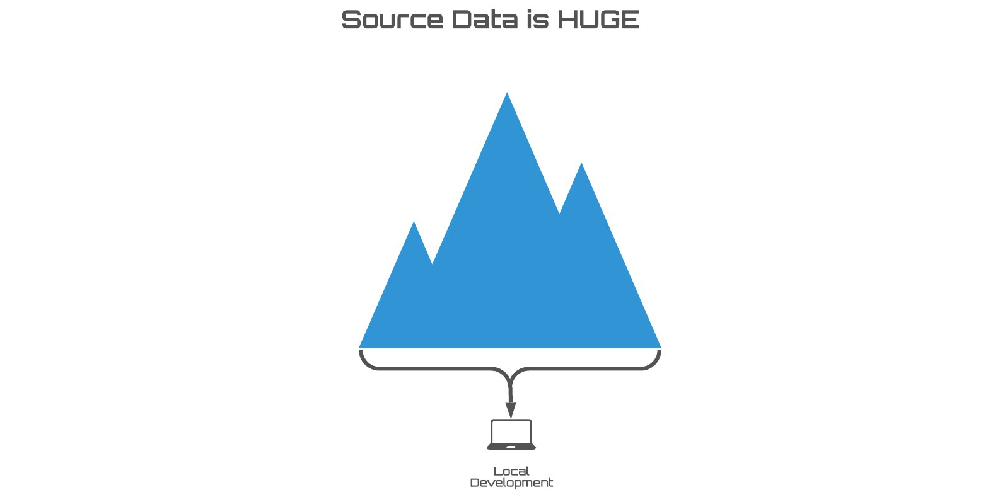
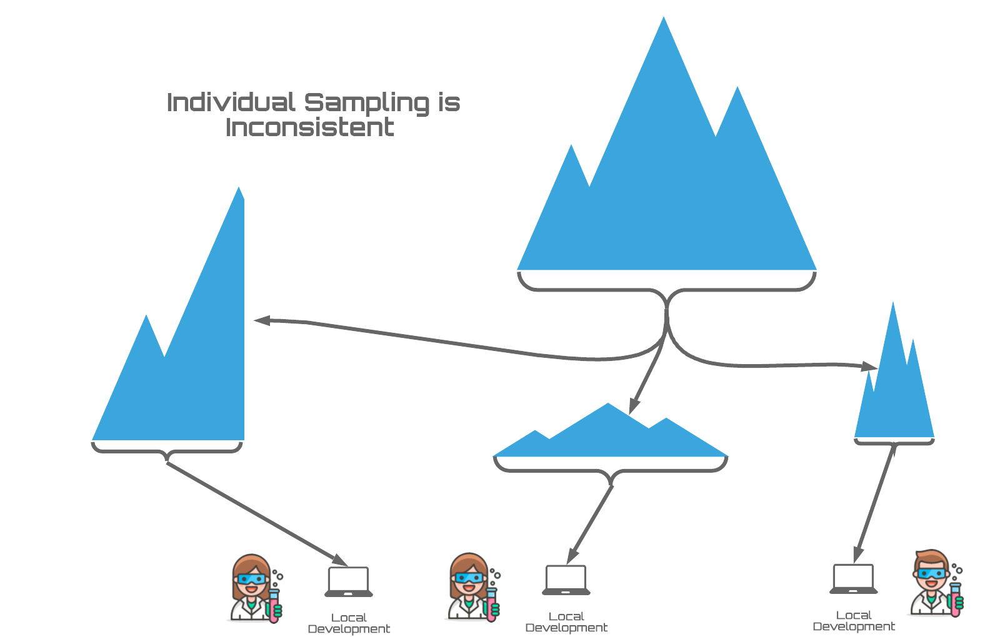
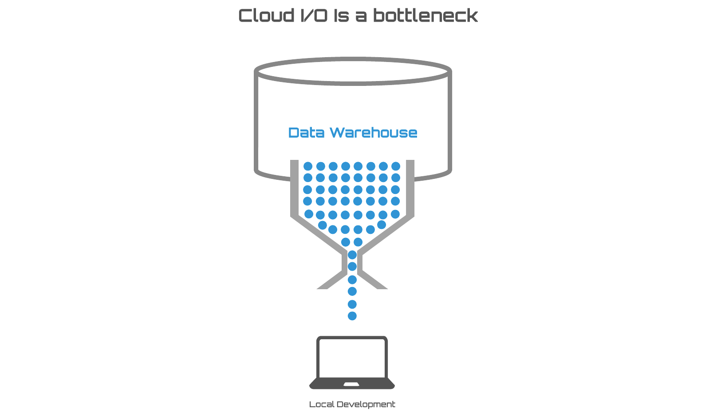

.. image:: ../assets/snowshu_logo.png
   :alt: SnowShu

=======================
Introduction to SnowShu
=======================

*SnowShu is a sampling engine designed to support testing in data development.* 

Why Sample? 
===========

Statisticians have long understood that it isn’t always practical (or even possible!) to study an entire population. If we wanted to learn what percentage of homeowners in the USA claim to enjoy mowing their lawn, it would be impossible to ask all 136+ million of them! So instead we use a carefully crafted sample, or subset of homeowners that offers a reasonable representation.

In data development populations can also be impractical to work with. Say you wrote a few lines of code to add a ``user_type`` value to your web traffic events, and you want to test it out. Running this code against the full population (billions of events!) could take hours. If the code doesn’t behave as expected you would have to start over, each time waiting for it to complete. 

Why Not Just Take Samples?
==========================

Sampling is actually pretty hard. Data developers will sometimes use sample-ish hacks (like testing with the last 3 days’ worth of data, or using a ``sample`` function built into the database) but these can often come back to bite you. Samples need to take into account referential integrity and unevenly distributed data if they are to be any use when testing. 

Why Share?
==========

When data teams want to collaborate and discuss code, it is helpful to compare apples-to-apples outputs. The only way to really do that is with matching input data, which the shared immutable samples from SnowShu provide.

Why Localize? 
=============

Most modern data stores exist in the cloud. This has plenty of advantages, but the downside is that data must travel great distances between the server and your laptop. This trip is one of the slowest parts of data development. By bringing your sampled data into your local workspace you can eliminate the bottleneck completely.

What Does SnowShu Do? 
=====================

SnowShu makes it easy to create a catalog of sampled data from your larger production data store (usually a cloud data warehouse, data lake or MRFS). SnowShu manages selecting the smallest possible sample that will accurately represent the data store population, while taking into account considerations such as  referential integrity and margin of error. This dataset becomes a SnowShu **replica** - a local emulator that can be queried just like you would the population data store. This replica is an immutable image, so spinning up new replicas becomes trivial. 

How Do I Use SnowShu?
=====================

With SnowShu you simply select the source databases, schemas and relations (tables and views) you need for development. SnowShu creates a localized emulator of that data, called a replica, that you can query directly during development.

To use SnowShu replicas you need to first create them. A guide to getting started with that in the full `user documentation <user_documentation/user_documentation>`__.
Since SnowShu replicas are essentially configured Docker containers, you do not actually need SnowShu installed to use them (though installing SnowShu does provide a handful of helper tools even when you are not building replicas).
To install:

>>> pip install snowshu

To find a list of replicas available to your Docker instance:

>>> snowshu list
    AVAILABLE IMAGES:
    Replica name    modified             source    replica engine    docker image
    --------------  -------------------  --------  ----------------  -----------------------------------------------------------------------------
    warehouse       0001-01-01 00:00:00  default   PostgresAdapter   19920719.dkr.ecr.us-east-1.amazonaws.com/snowshu_replica_warehouse:latest

You can configure your replica with normal Docker commands (or with ``docker-compose``). SnowShu replicas listen on port ``9999`` and use ``snowshu`` as the user, password, and default database. To make connection easier SnowShu comes with the command:

>>> snowshu launch-docker-cmd warehouse # in this example the replica name is "warehouse"
    docker run -d -p 9999:9999 --rm --name warehouse 19920719.dkr.ecr.us-east-1.amazonaws.com/snowshu_replica_warehouse:latest

For bash users this makes starting a replica as easy as:

>>> $(snowshu launch-docker-cmd warehouse)
    b6d4d600bd46be997fd9d9bfkfc4d8b6cfdfk660a4ee76db60fka9fkfkad9dadeac7f # returns hash of running container

How Do I Get Help?
==================

- Check out the `user documentation <user_documentation/user_documentation>`__ for tips and tricks on how to get rolling with SnowShu. 
- Connect with SnowShu users and developers in our `Slack Workspace <https://snowshu.slack.com>`__.
- Found a bug? Let us know in the `SnowShu Project <https://bitbucket.org/healthunion/snowshu/issues?status=new&status=open>`__.

Additional Resources
--------------------

.. toctree::
   :maxdepth: 2

   user_documentation/user_documentation
   developer_documentation/developer_documentation
   code_documentation/code_documentation

